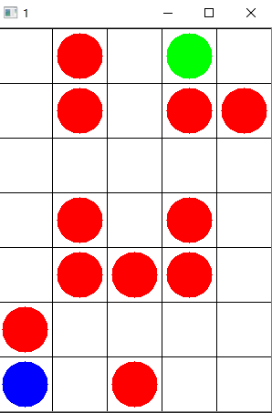

# 基于强化学习DQN实现的走迷宫程序

最近有一个作业要用DQN走迷宫，我整理了一些参考的程序，这个项目是我觉得比较好的一个。非常适合学习。

代码主体来源于https://github.com/KeyanChen1012/DQN_MazeGame。

做了如下改动：
+ 支持自定义的迷宫结构
+ 可以打印模型找到的出口路径
+ reward上新增不走回头路机制，提升大型迷宫搜索能力
+ 优化了参数设定
+ 简化了reward部分代码

在以下的仿真场景中，可以在2分钟内找到出口。（绿色是终点，蓝色是起点，红色是陷阱）



## demo

运用`Main.py`即可，在CPU上约2min可找到出口。

```
epoch 989 16 成功
['right', 'up', 'right', 'right', 'right', 'up', 'up', 'up', 'left', 'left', 'up', 'up', 'right']
epoch 990 -1 失败
epoch 991 16 成功
['right', 'up', 'down', 'up', 'right', 'right', 'right', 'up', 'up', 'up', 'left', 'left', 'up', 'up', 'right']
epoch 992 16 成功
['right', 'left', 'right', 'up', 'right', 'right', 'right', 'up', 'up', 'up', 'left', 'left', 'up', 'up', 'right']
epoch 993 16 成功
['right', 'up', 'right', 'right', 'right', 'up', 'up', 'right', 'up', 'left', 'left', 'left', 'right', 'up', 'up', 'right']
epoch 994 16 成功
['right', 'up', 'right', 'right', 'right', 'up', 'up', 'up', 'left', 'left', 'up', 'up', 'right']
```


## 如何自定义迷宫
+ 在`Game`中用矩阵表示迷宫布局，并指定起点

```
        self.migong = [[0, 3, 0, 2, 0],
                       [0, 3, 0, 3, 3],
                       [0, 0, 0, 0, 0],
                       [0, 3, 0, 3, 0],
                       [0, 3, 3, 3, 0],
                       [3, 0, 0, 0, 0],
                       [0, 0, 3, 0, 0]]
					   
        self.migong[self.y1][self.x1] = 1
```

+ 调节参数


## 其他算法

欢迎补充。


